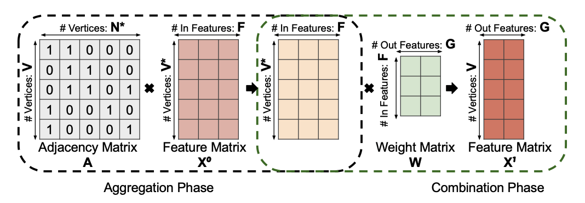
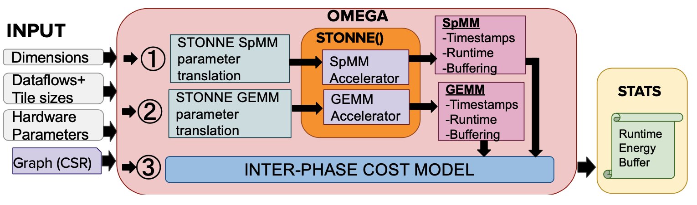

# Tutorial

We are organizing a tutorial at ASPLOS 2022 Tutorial for STONNE and OMEGA ([STONNE+OMEGA Tutorial])(https://stonne-simulator.github.io/ASPLOSTUT.html)

# Codebase


For a stable version of codebase, please refer to the docker image used in the tutorial.

```
docker run -it franciscomunoz/stonne_omega_img /bin/bash
```

# Documentation

Please refer to the [STONNE simulator](https://github.com/stonne-simulator/stonne) for details on simulation of an individual kernel simulation. OMEGA is a wrapper around the STONNE simulator that instanciates SpMM and GEMM simulation, takes the individual kernel statistics and applies an analytical equations on these statistics to return the statistics for Inter-phase dataflows. 

OMEGA takes the following inputs

<ul>
<li>Dimensions

  * -V, -F, -G, -E (Edges, required for parsing)
<li>Tile sizes for both phases. VF matrix is shared across phases so we use 'a' and 'c' to refer to the phase for which tile size is being specified

 * -T_Va, -T_N, -T_Fa, -T_Vc, -T_G, -T_Fc
<li>Hardware Parameters

  * -Pe_agg, -Pe_cmb, -dn_bw_agg, -dn_bw_cmb, -rn_bw_agg, -rn_bw_cmb
<li>Path to Input files for the adjacency matrix (CSR representation). Refer to sample_graphs directory

  * -vertex_path, edge_path
</ul> 

# GNN Dataflow Analysis Using OMEGA Framework



GNNs are becoming increasingly popular because of their ability to accurately learn representations from graph structured data. GNN inference runtime is dominated by two phases: (1) *Aggregation* which is an SpMM computation with irregular, workload dependent data accesses, and (2) *Combination* computations that can be cast as GEMMs, similar to dense DNNs as shown in the figure above. Prior works on DNN dataflow studies have described the data orchestration and data movement in DNN accelerators. However, these works only model dense computations and model one GEMM or convolution operation at a time. GNNs offer an additional knob of pipelining between the two phases which also leads to interdependence of the two dataflows.

## Taxonomy for GNN Dataflows

We aim to provide analysis of the design-space of GNN dataflows over flexible accelerator (for example - MAERI) which captures both individual phase dataflows (Intra-phase dataflows) and dataflows between the two phases (Inter-phase dataflows). 
To enable this, we propose a taxonomy that expresses: (1) *Aggregation intra-phase dataflow* (2) *Combination intra-phase} dataflow* (3) *Inter-phase strategy*, and (4) *phase ordering* targetting a flexible accelerator like [MAERI](https://dl.acm.org/doi/pdf/10.1145/3173162.3173176) which can support execution of all possible dataflows.

## OMEGA Framework

We also demonstrate the OMEGA (**O**bserving **M**apping **E**fficiency over **G**NN **A**ccelerator) framework that we build on top of [STONNE](https://stonne-simulator.github.io) which enables us to model the cost of the pipelined GNN dataflows.

It is built around [STONNE simulator](https://stonne-simulator.github.io), [STONNE codebase](https://github.com/stonne-simulator/stonne)

It instantiates SpMM and GEMM on STONNE's flexible accelerator model [MAERI](https://dl.acm.org/doi/pdf/10.1145/3173162.3173176) and feeds the statistics to an inter-phase cost model that returns the metrics of a pipelined inter-phase dataflow as shown in Figure below.



## Resources

### Publication

For more details, please refer to our [pre-print](https://arxiv.org/pdf/2103.07977).

Update: The paper has been accepted for publication in IPDPS 2022.

### Bibtex

```
@inproceedings{garg2021understanding,
  title={Understanding the Design-Space of Sparse/Dense Multiphase GNN dataflows on Spatial Accelerators},
  author={Garg, Raveesh and Qin, Eric and Mu{\~n}oz-Mart{\'\i}nez, Francisco and Guirado, Robert and Jain, Akshay and Abadal, Sergi and Abell{\'a}n, Jos{\'e} L and Acacio, Manuel E and Alarc{\'o}n, Eduard and Rajamanickam, Sivasankaran and Krishna, Tushar},
  booktitle={2022 IEEE International Parallel and Distributed Processing Symposium (IPDPS)},
  year={2022}
```
